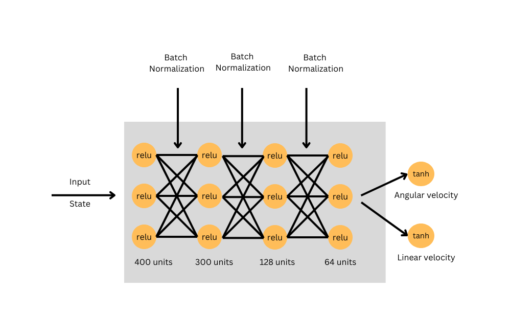
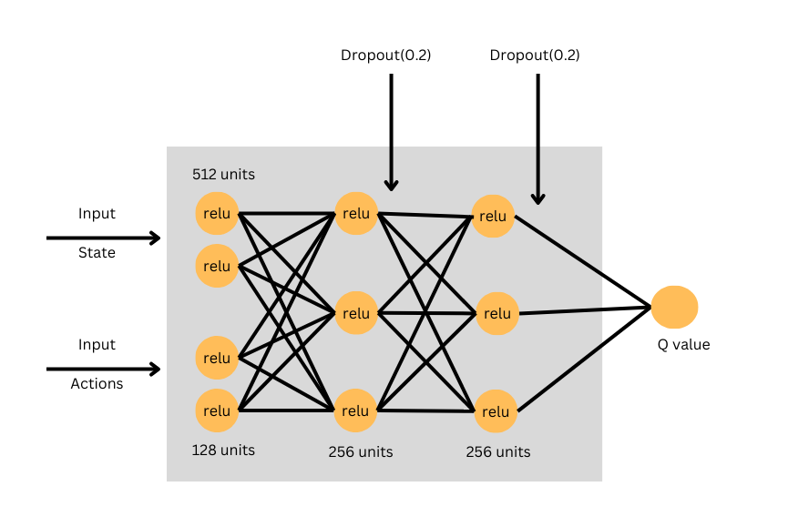
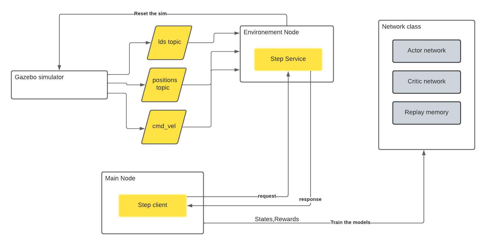
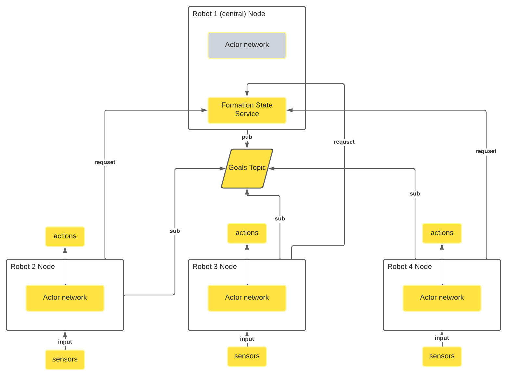
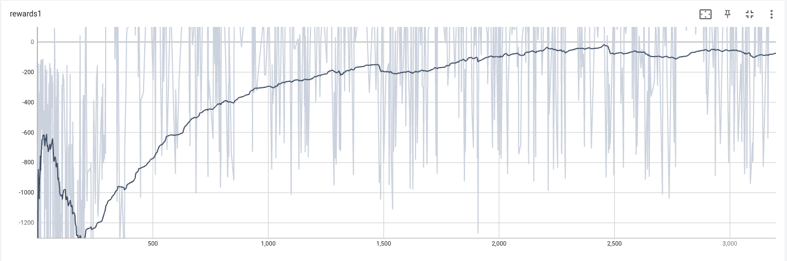
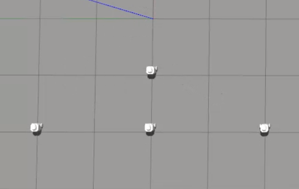
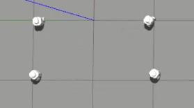
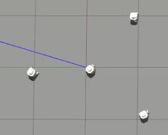

# Swarm robotics self shape formation

This repository includes my master's degree final year project in AI.
## Abstarct

Swarm robotics is a fast-expanding field that includes coordinating sizable groups
of robots to cooperate in order to achieve a common objective. There are multi-
ple tasks and problems that swarm robots try to solve; one of them is the pattern
formation problem, where the robots try to form geometric shapes. It has many
applications in agriculture, search and rescue, and warehouses. One of the methods
used to control the swarm is deep reinforcement learning algothims. In our project,
we used the DDPG RL algorithm to control a team of robots to form some patterns
with the help of a central robot that will monitor and guide the robots towards
their target goals by generating the shape relative to his position. Our algorithm
got an accuracy of 95% when tested on a random set of shapes when the number of
robots is 3, 4. and 88% on five robots, and 72% when tested on a group of six robots.

### Keywords:
Swarm robotics, Reinforcement lerarning, DDPG,Ros,Pattern foram-
tion,Gazebo

### Figures:

